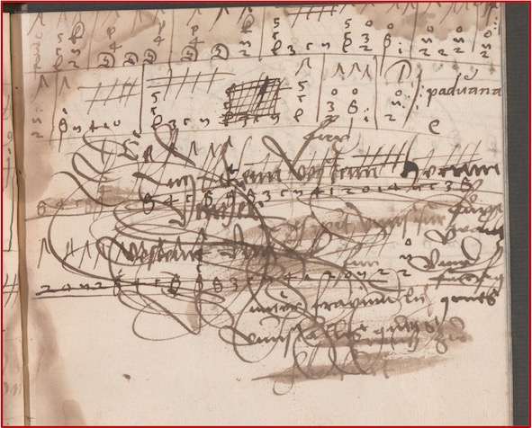

    

        

            
 
                <a href="/presentation">
                    
                    

                        <h5 class="card-title">Präsentation</h5>
                        
Kurzbeschreibung zu Präsentation

                    

                </a>
            

            
 
                <a href="/news">
                
                

                    <h5 class="card-title">News</h5>
                    
Kurzbeschreibung zu News

                

                </a>
            

            
 
                <a href="/team">
                
                

                    <h5 class="card-title">Team</h5>
                    
Kurzbeschreibung zu Team

                

                </a>
            

            
 
                <a href="/partner">
                
                

                    <h5 class="card-title">Partner</h5>
                    
Kurzbeschreibung zu Partner

                

                </a>
            

        

        

        

        

            
 
                <a href="/edition">
                
                

                    <h5 class="card-title">Edition</h5>
                    
Kurzbeschreibung zu Edition

                

                </a>
            

            
 
                <a href="/pilotI">
                
                

                    <h5 class="card-title">Forschung: Pilot I</h5>
                    
Kurzbeschreibung zu Forschung: Pilot I

                

                </a>
            

            
 
                <a href="/pilotII">
                
                

                    <h5 class="card-title">Forschung: Pilot II</h5>
                    
Kurzbeschreibung zu Forschung: Pilot II

                

                </a>
            

            
 
                <a href="/pilotIII">
                
                

                    <h5 class="card-title">Forschung: Pilot III</h5>
                    
Kurzbeschreibung zu Forschung: Pilot III

                

                </a>
            

        

        

        

        

            
 
                <a href="/pilotIV">
                    
                    

                        <h5 class="card-title">Forschung: Pilot IV</h5>
                        
Kurzbeschreibung zu Forschung: Pilot IV

                    

                </a>
            

            
 
                <a href="/news">
                
                

                    <h5 class="card-title">Forschung: Pilot V</h5>
                    
Kurzbeschreibung zu Forschung: Pilot V

                

                </a>
            

            
 
                <a href="/team">
                
                

                    <h5 class="card-title">MEI &amp; TEI</h5>
                    
Kurzbeschreibung zu MEI &amp; TEI

                

                </a>
            

            
 
                <a href="/aspects">
                
                

                    <h5 class="card-title">Einzelne Aspekte</h5>
                    
Kurzbeschreibung zu Einzelne Aspekte

                

                </a>
            

        

        

        

        

            
 
                <a href="/workshop">
                
                

                    <h5 class="card-title">Workshop</h5>
                    
Kurzbeschreibung zu Workshop

                

                </a>
            

            
 
                <a href="/collaboration">
                
                

                    <h5 class="card-title">Kollaborative Edition</h5>
                    
Kurzbeschreibung zu Kollaborative Edition

                

                </a>
            

        

    

### Die Laute im deutschsprachigen Raum 1450–1550

Wir erstellen eine umfassende elektronische Edition von Lautentabulaturen (spezielle Notationen für Lauten) aus dem deutschsprachigen Raum zwischen 1450 und 1550. Das Corpus (2.000 Seiten) wurde in seiner Gesamtheit bisher nicht erschlossen und blieb daher sowohl für die Wissenschaft und professionelle Musiker als auch für den weiteren Kreis von Interessierten kaum zugänglich, wurde nicht entschlüsselt und konnte somit nur punktuell ausgewertet werden. Die Gründe dafür sind die heute nicht mehr verwendete Notation ("Deutsche Lautentabulatur"), die über ganz Mitteleuropa verstreuten Aufbewahrungsorte der Manuskripte und der Mangel an ausgearbeiteten, einheitlichen Forschungsmethoden.

Unser Ziel ist, eine neuartige Form der Musikedition zu entwickeln: Eine "open knowledge platform", in der Musikwissenschaft, Musikpraxis, Musikinformatik und Literaturwissenschaft ineinandergreifen und herkömmliche Editionsmethoden in disziplinärer und interdisziplinärer Forschung vernetzen. Um eine umfassende moderne Gesamtedition zu gestalten, synchronisieren wir Computer-Hochtechnologie (Enkodierung, Verlinkung, Erkennung (OMR) und automatische Transkription) mit manueller Musiktranskription und musikalischer Aufführungspraxis. Aufnahmen der Lautenmusik betrachten wir als konzeptuellen Bestandteil der Edition. Alle Komponenten werden mit musikhistorischen und aufführungspraktischen Informationen versehen und verlinkt. Die Edition wird dauerhaft von der Österreichischen Nationalbibliothek gehostet und in RISM integriert. Unsere Nutzer werden co-edietieren können, denn wir entwickeln ein Annotationstool, das es ermöglicht, Kommentare, Beobachtungen und Interpretationen zu posten. [Mehr...](/presentation)

